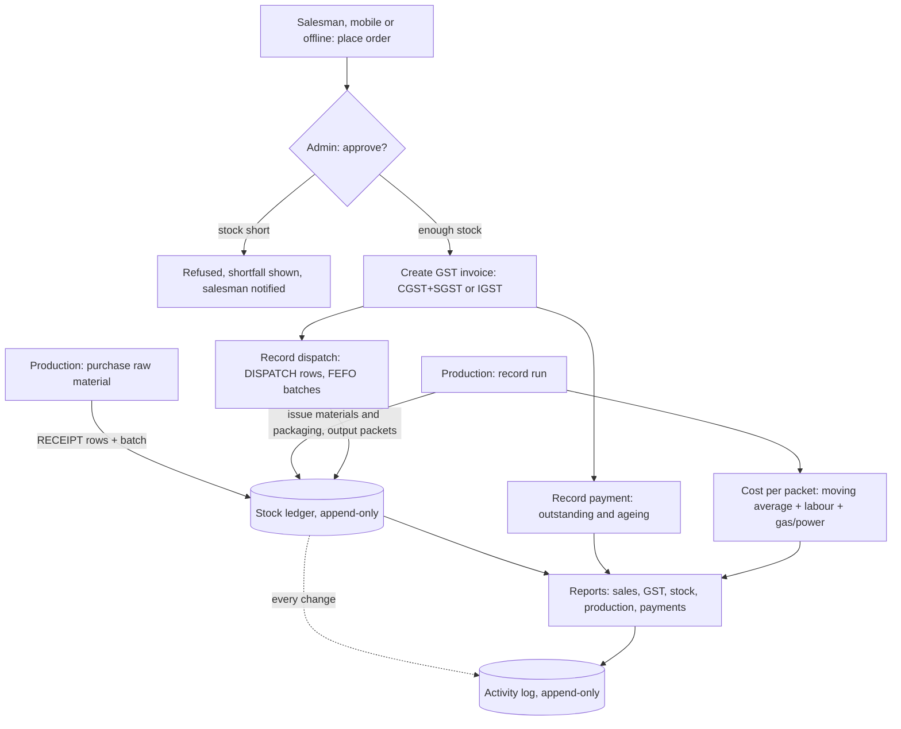
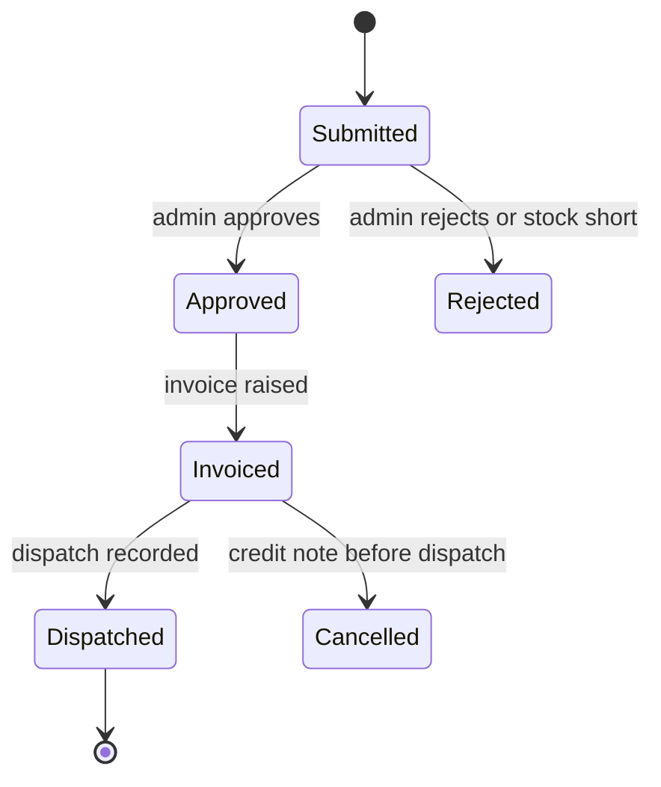

# Workflow: order to audit

Who does what, and which ledger row each step writes. Renders on GitHub.

```mermaid
flowchart TD
  P[Production: purchase raw material] -->|RECEIPT rows + batch| S[(Stock ledger, append-only)]
  PR[Production: record run] -->|issue materials and packaging, output packets| S
  PR --> C[Cost per packet: moving average + labour + gas/power]
  SM[Salesman, mobile or offline: place order] --> A{Admin: approve?}
  A -->|stock short| N[Refused, shortfall shown, salesman notified]
  A -->|enough stock| I[Create GST invoice: CGST+SGST or IGST]
  I --> D[Record dispatch: DISPATCH rows, FEFO batches]
  D --> S
  I --> PAY[Record payment: outstanding and ageing]
  S --> R[Reports: sales, GST, stock, production, payments]
  PAY --> R
  C --> R
  S -. every change .-> L[(Activity log, append-only)]
  R --> L
```

## Order status

```mermaid
stateDiagram-v2
  [*] --> Submitted
  Submitted --> Approved: admin approves
  Submitted --> Rejected: admin rejects or stock short
  Approved --> Invoiced: invoice raised
  Invoiced --> Dispatched: dispatch recorded
  Invoiced --> Cancelled: credit note before dispatch
  Dispatched --> [*]
```
